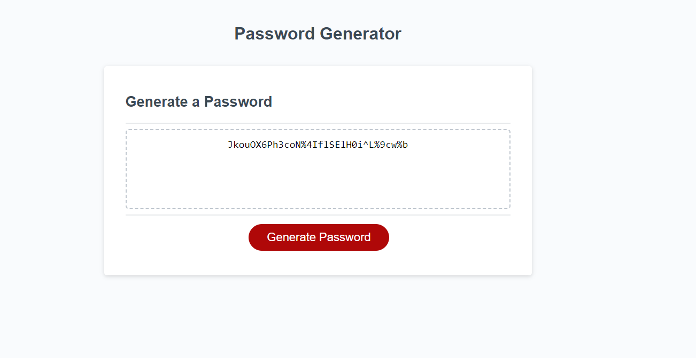

# Password Generator Starter Code

Blake's Deployed Password Generator

## Description

This is a password generator that I made for an assignment, but at the end of the day I will find great personal  use for this so I was quite excited to work on this. The website itself is not of my own design but I have heavly adjusted the JavaScript within to fufil my personal needs and the assignments requierments, but heres what the website should look like after a random password is generated. 

## Usage

The functionallity of this website is very straight forward, when you click hte generate password button you will be prompted with options that you will fill out to generate the desiered password. When gereating the password you will first be prompted on what length you would like the password to be ranging from 8 to 128 characters, then it will move to if you would like to have exclusivly lowercase, uppercase letters, or a mix between the two, finishing with if youd like there to be numbers(1, 2, 3...) or sepceial characters(!, @, #, $...). After finishing all prompts you will then be provided a random password as seen in the picture above.

## Credits

N/A

## License

Please refer ti the LICENSE in the repo.